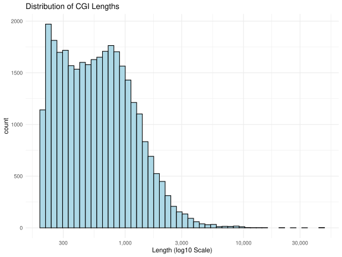

{width=80% fit-align="center"}

::: {.text-center .fw-bold style="color: #6E3778; font-size: 28px;"}
[A]{style="color: #008CA5"}nalysis [L]{style="color: #008CA5"}oolkit for [La]{style="color: #008CA5"}rge [S]{style="color: #008CA5"}tudies of [Bis]{style="color: #EBB400"}ulfite-sequencing : [ATLAS]{style="color: #008CA5"}[²]{style="color: #EBB400"}
:::

::: {style="text-align: justify; font-size: 19px;"}
<b>ATLAS²</b> is a Nextflow-based pipeline for <b>reproducible</b>, <b>scalable</b>, and <b>comprehensive analysis</b> of bisulfite sequencing data. <u>Designed for both newly generated and publicly available datasets</u>, it performs extensive quality control, preprocessing, alignment, methylation calling, and exploratory analyses. With detailed reports and standardized outputs, <b>ATLAS²</b> delivers analysis-ready results that can be directly used for visualization, statistical modeling, and downstream epigenomic studies, from small experiments to large scale studies
:::

::: {.text-center .mt-5}
<a href="docs/get_started/index.qmd" class="get-started-btn">Get Started</a>
:::